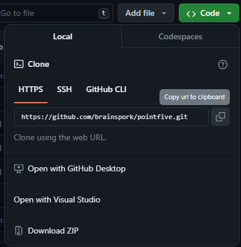

# pointfive

Developed with Unreal Engine 5

## Requirements

- [git](https://git-scm.com/downloads)
- [git LFS Extension](https://git-lfs.com/)
- [GitHub account](https://github.com/)
- UE 5.3

### UE Requirements

- PaperZD

## Setup

1. Create a GitHub account
2. Install git for your operating system
3. Set up git on your machine
   1. Open a new terminal (command line, powershell, whatever)
   2. Type `git` into your terminal. You should see a list of common git commands.
   3. Set your git user name with `git config --global user.name "your user name"`
   4. Set your git email with `git config --global user.email "your email"`
4. Clone the project to your machine
   1. From the repository page in GitHub, copy the https link from the Code dropdown 
   2. From a terminal navigate to the folder your Unreal project folders are in (use `cd C:/absolute/folder/path` or `cd ../../relative/file/path` where `..` navigates up a folder from your starting location. `ls` will print the contents of the folder to the console if you need to check where you are)
   3. Once in your Unreal folder, run `git clone https://repository.url` with the url you copied in step 4.1. This will download the source for this project into a folder called "pointfive"
   4. Open the project in Unreal. If you get errors saying you need PaperZD, [add PaperZD to Unreal](https://docs.unrealengine.com/5.0/en-US/working-with-plugins-in-unreal-engine/)
   5. Run the project and see if it works (WASD movements, LShift to sprint a little)

## Making changes

[git cheet sheet](https://education.github.com/git-cheat-sheet-education.pdf)

Git uses branches which essentialy are references to the initial code state of the branch you started from at the time the new branch was created. They are used to develop features without changing the main body of code until the feature is complete.

So, say I want to add sprint feature to our player character. I can create a branch off of main and start working on the functionallity. Once I'm done I push my branch to the repository on GitHub and create a Pull Request which is a request to merge my feature into the main body of code. Other people working on the project have a chance to review the code changes and make suggestions. If there are no issues, the Pull Request can be completed and the code is now in the main branch.

- Git LFS Extension

## Git cheatsheet
Create a new branch: `git checkout -b branchname`
Push branch to repo: `git push origin branchname`
View change status: `git status`
Stage all changes: `git stage *`
Commit changes: `git commit -m "Message describing changes"`
Pull changes `git pull`
Pull changes from other branch: `git pull origin branchname`
View branches: `git branch`